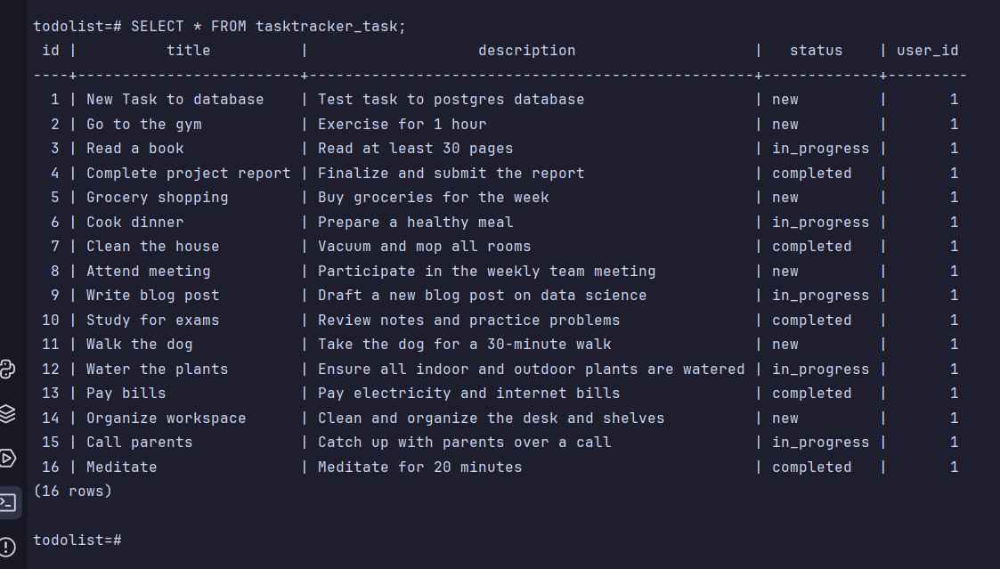

# ToDo List API

This project is a ToDo List API built with Django and Django REST Framework, using PostgreSQL as the database. The project is containerized with Docker to ensure consistent development and deployment environments.

## Table of Contents

- [Installation](#installation)
- [Database Setup](#database-setup)
- [Running the Application](#running-the-application)
- [API Documentation](#api-documentation)
- [Usage](#usage)
- [Testing](#testing)
- [Contributing](#contributing)
- [License](#license)

## Installation

1. **Clone the repository:**

   ```bash
   git clone https://github.com/oksankakot/todo_list.git
   cd todo_list
   ```

2. **Create a virtual environment and activate it:**
    ```bash
    python -m venv venv
    source venv/bin/activate  # On Linux or macOS
    venv\Scripts\activate  # On Windows
    ```

3. **Install the dependencies:**
    ```bash
   pip install -r requirements.txt
    ```

## Database Setup

1. **Start the PostgresSQL container:**
    ```bash
    docker-compose up -d
    ```
   
2. **Configure Django to use PostgresSQL:**  

    In your settings.py file, update the DATABASES configuration:

```python
DATABASES = {
    'default': {
        'ENGINE': 'django.db.backends.postgresql',
        'NAME': 'todolist',
        'USER': 'postgres',
        'PASSWORD': 'postgres',
        'HOST': 'localhost',
        'PORT': '5432',
    }
}
```

3. **Apply migrations:**
    ```bash
   python manage.py migrate
    ```

4. **Create a superuser:**
    ```bash
    python manage.py createsuperuser
    ```

## Running the Application

1. **Start the Django development server:**
    ```bash
    python manage.py runserver
   ```

2. **Access the application:**
    Open your browser and navigate to http://127.0.0.1:8000.


## API Documentation

**Authentication**
    Obtain token:
    ```bash
    POST /api/token/
   ```

**Request Body:**

```json
{
    "username": "your_username",
    "password": "your_password"
}
```

**Refresh Token:**
```bash
POST /api/token/refresh/
```

**Request Body:**
```json
{
  "refresh": "your_refresh_token"
}
```

## Task Endpoints

**Create a Task:**
```bash
POST /api/tasks/create-task/
```
Request Body:
````json
{
  "title": "New Task",
  "description": "Task description",
  "status": "new"
}
````

**Get All Tasks:**
```bash
GET /api/tasks/all-tasks/
```

**Get User Tasks:**
```bash
GET /api/tasks/user-tasks/
```

**Get Task Detail:**
```bash
GET /api/tasks/<int:pk>/
```

**Update Task:**
```bash
PUT /api/tasks/<int:pk>/update/
```
Request Body:
```json
{
  "title": "Updated Task",
  "description": "Updated description",
  "status": "in_progress"
}
```

**Delete Task:**
```sql
DELETE /api/tasks/<int:pk>/delete/
```

**Filter Tasks by Status:**
```bash
GET /api/tasks/tasks-by-status/<str:task_status>/
```

## Usage

1. **Using Postman:**
    - Obtain your access token by making a POST request to /api/token/ with your username and password.
    - Use the obtained access token to authenticate subsequent requests by adding it to the Authorization header as Bearer <your_access_token>.

2. **Example: Create a Task**
```json
{
  "title": "Example Task",
  "description": "This is an example task",
  "status": "new"
}
```
**Example**


## Testing

To run the tests, use the following command:
```bash
python manage.py test
```

## Contributing

1. Fork the repository.
2. Create a new branch (git checkout -b feature-branch).
3. Commit your changes (git commit -m 'Add new feature').
4. Push to the branch (git push origin feature-branch).
5. Create a new Pull Request.

## License
This project is licensed under the MIT License - see the [LICENSE](https://docs.github.com/en/repositories/managing-your-repositorys-settings-and-features/customizing-your-repository/licensing-a-repository) file for details.
